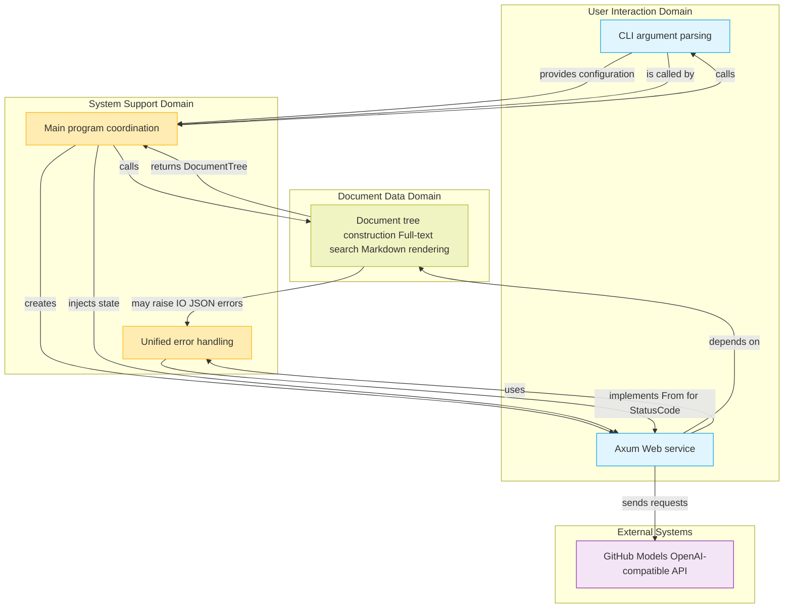
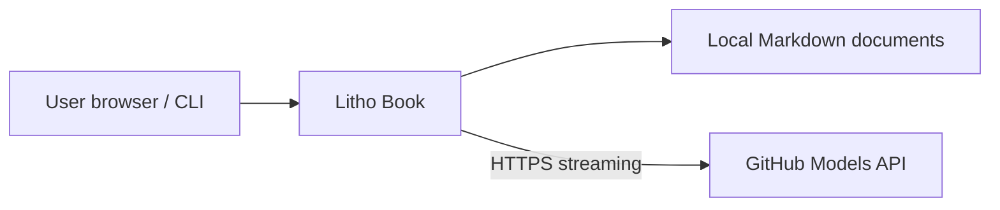
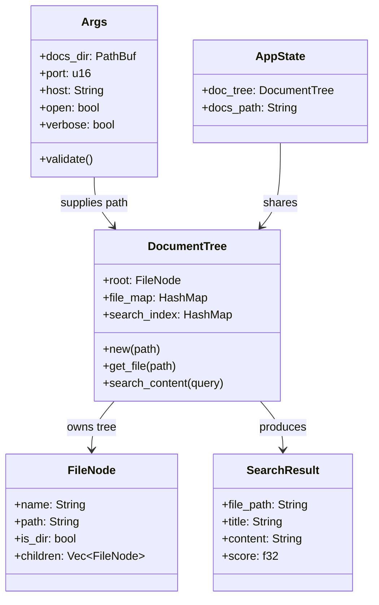
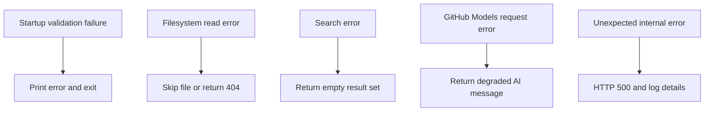
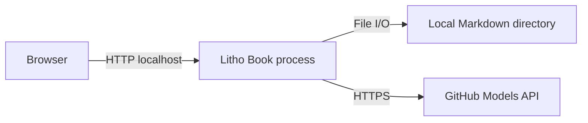

# System Architecture Document

## 1. Architecture Overview

### Architecture Design Philosophy
Litho Book is a full-stack application for local knowledge management. Its design follows **separation of concerns** and **high cohesion with low coupling**. Clear module boundaries separate user interaction, data processing, and system support so each component has a single responsibility.

The system uses a hybrid **CLI startup + Web service** model. It keeps the configuration style familiar to developers while providing a modern browser-based reading experience. The architecture emphasizes:
- **Type safety**: Rust's strong type system reduces runtime errors.
- **Zero-cost abstractions**: Tokio enables high-performance asynchronous I/O.
- **Memory safety**: Rust prevents common vulnerabilities such as null pointers and buffer overflows without a garbage collector.
- **Maintainability**: Modular design supports future extension and refactoring.

### Core Architecture Pattern
The system uses a typical **layered architecture** with three domains:
1. **User interaction domain**: CLI argument parsing and HTTP request/response handling.
2. **Document data domain**: File scanning, content indexing, Markdown rendering, and search.
3. **System support domain**: Logging, error handling, and startup coordination.

At the Web layer, Axum uses functional routing and state injection. Shared resources such as `DocumentTree` are safely passed to request handlers through `AppState`.

### Technology Stack
| Category | Technology | Description |
|----------|------------|-------------|
| **Web framework** | Axum | High-performance Rust Web framework based on Tokio, with async handlers. |
| **Async runtime** | Tokio | Asynchronous task scheduling and I/O multiplexing. |
| **CLI parsing** | Clap | Command-line argument parser with generated help output. |
| **Error handling** | Anyhow + ThisError | Unified application-level error handling. |
| **Logging** | Tracing + Subscriber | Structured logs with configurable levels. |
| **JSON serialization** | Serde | Efficient serialization and deserialization. |
| **HTTP client** | Reqwest | Async HTTP client with streaming-response support. |
| **Markdown rendering** | Pulldown-Cmark / project renderer | Safe and efficient Markdown-to-HTML conversion. |
| **Time handling** | Chrono | Date and time operations with serialization support. |



---

## 2. System Context

### System Positioning and Value
Litho Book is a local knowledge-enhancement system that addresses fragmentation in personal knowledge management. It converts local Markdown documents into a structured, searchable knowledge base and integrates an AI assistant to improve retrieval efficiency and writing workflows.

**Core business value**:
- ✅ **Offline availability**: Documents remain local and are not uploaded to the cloud.
- ✅ **Fast access**: Start a Web service with one command and browse immediately.
- ✅ **Intelligent search**: Full-text keyword matching with relevance ranking.
- ✅ **AI assistance**: Natural-language Q&A for explanations based on document content.
- ✅ **Lightweight efficiency**: Single-binary deployment without complex dependencies.

### User Roles and Scenarios
| Role | Typical scenarios |
|------|-------------------|
| **Developer** | Quickly read technical documentation or API notes; display code notes structurally in a browser; use AI to understand complex architecture. |
| **Knowledge worker** | Organize book notes and research materials; locate historical records by keyword; review knowledge through conversation. |

### External System Interaction
| External system | Interaction method | Purpose |
|-----------------|--------------------|---------|
| **GitHub Models OpenAI-compatible API** | HTTP/REST + SSE | Obtain streaming AI answers for document Q&A. |

> ⚠️ **Security reminder**: The GitHub Models API token is read from `GITHUB_TOKEN`; do not hardcode tokens in source or docs.

### System Boundary Definition
#### Included Components
- CLI argument parsing (`cli.rs`)
- Filesystem scanning and document-tree construction (`filesystem.rs`)
- Unified error handling (`error.rs`)
- Axum HTTP server (`server.rs`)
- Main entry-point coordination (`main.rs`)

#### Excluded Components
- React/Vue frontend; the HTML template is statically embedded.
- Markdown authoring or generation tools.
- Document version control such as Git.
- User authentication and authorization.
- Cloud-storage synchronization.
- AI model training or fine-tuning.



---

## 3. Container View

### Domain Module Division
| Domain | Representative modules | Responsibility |
|--------|------------------------|----------------|
| User interaction domain | `cli.rs`, `server.rs` | Parse CLI input, expose Web APIs, and return HTML/JSON/SSE responses. |
| Document data domain | `filesystem.rs` | Scan files, build trees, index content, search, and provide document data. |
| System support domain | `main.rs`, `error.rs` | Coordinate startup, initialize logging, map errors, and control lifecycle. |

### Domain Module Architecture
#### User Interaction Domain
- `cli.rs` defines the `Args` structure and validates `--path`, `--port`, `--host`, `--open`, and `--verbose`.
- `server.rs` defines HTTP routes for document browsing, search, and AI chat.
- Route handlers use Axum extractors and return typed responses.

#### Document Data Domain
- Recursively scans the document root.
- Builds `FileNode` hierarchy and the `DocumentTree` aggregate.
- Maintains `file_map` for path lookup and `search_index` for full-text search.
- Renders Markdown as HTML when files are requested.

#### System Support Domain
- `main.rs` orchestrates command parsing, validation, document loading, router creation, socket binding, browser launch, and Axum serving.
- `error.rs` maps application errors to HTTP status codes.
- `tracing` provides observability throughout the startup and request lifecycle.

### Storage Design
The current design is memory-resident:
- `DocumentTree` stores the directory structure and statistics.
- `file_map` maps logical document paths to filesystem paths.
- `search_index` stores searchable lines for each Markdown file.
- No database is required; persistent storage remains the user's local filesystem.

### Communication Between Domain Modules
| Communication path | Type | Description |
|--------------------|------|-------------|
| `main.rs` → `cli.rs` | Function call | Parse and validate runtime configuration. |
| `main.rs` → `filesystem.rs` | Function call | Build `DocumentTree` from the document root. |
| `main.rs` → `server.rs` | State injection | Pass the document tree and docs path into `AppState`. |
| `server.rs` → `filesystem.rs` | In-memory call | Search or load document content. |
| `server.rs` → `reqwest` → `GitHub Models` | External service call | Stream AI responses from GitHub Models. |

---

## 4. Component View

### Core Functional Components
#### `DocumentTree` Component
`DocumentTree` is the central aggregate for document data. It owns:
- Root `FileNode` tree.
- `file_map` for path resolution.
- `search_index` for full-text retrieval.
- Statistics such as file count and total size.

Its main operations are construction from a directory, file lookup, and keyword search.

#### `AppState` Component
`AppState` is shared by Axum handlers:
```rust
#[derive(Clone)]
pub struct AppState {
    pub doc_tree: DocumentTree,
    pub docs_path: String,
}
```
It provides immutable, cloned state to concurrent handlers without global mutable variables.

### Technical Support Components
#### `LithoBookError` Component
`LithoBookError` centralizes error categories such as I/O errors, JSON errors, invalid paths, and missing files. It converts domain failures into user-appropriate HTTP status codes.

#### `async-stream` Component
Streaming AI chat uses asynchronous streams to convert upstream AI response chunks into frontend SSE events. This keeps long-running generation non-blocking and provides incremental output.

### Component Responsibility Matrix
| Component | Responsibility | Main dependencies |
|-----------|----------------|-------------------|
| `Args` | CLI configuration and validation | clap, std::path |
| `DocumentTree` | Document tree, indexes, and search | std::fs, collections, serde |
| `FileNode` | Directory/file node metadata | serde |
| `SearchResult` | Search result payload | serde |
| `AppState` | Shared Web state | Axum state extraction |
| `LithoBookError` | Error abstraction and mapping | thiserror, axum::http |
| `OpenAIRequest` | AI API request envelope | serde |
| `OpenAIMessage` | AI chat message payload | serde |

### Component Interactions


---

## 5. Key Processes

### Core Functional Flows

#### Project Startup and Service Initialization
1. User runs `litho-book --path ./docs` with optional host, port, and browser flags.
2. `Args::parse()` parses CLI arguments.
3. `args.validate()` verifies the directory and port constraints.
4. Logging is initialized according to verbosity.
5. `DocumentTree::new()` scans Markdown files and builds indexes.
6. `create_router()` constructs Axum routes with `AppState`.
7. `TcpListener::bind()` binds the configured address.
8. The browser is optionally opened.
9. `axum::serve()` starts the HTTP service.

#### Document Full-Text Search
1. The frontend calls `/api/search?q=...`.
2. `server.rs` extracts and validates the query.
3. `DocumentTree::search_content()` scans indexed lines.
4. Matches are scored by basic matching, heading matching, exact terms, line position, and filename bonus.
5. Context snippets are highlighted.
6. Results are sorted by score and truncated to 50 entries.
7. JSON is returned to the frontend.

#### AI Assistant Streaming Chat
1. The frontend posts `{message, context, history}` to `/api/chat`.
2. The server builds a system prompt and document context.
3. An OpenAI-compatible request is created with system prompt, context, and history.
4. `reqwest` sends a streaming POST request to GitHub Models using `GITHUB_TOKEN`.
5. Response chunks are parsed as SSE data.
6. Text deltas are converted into frontend SSE events.
7. At completion, follow-up suggestions are generated and a finish event is sent.

### Exception Handling Mechanism


Failure handling is intentionally conservative. Browsing and search should continue whenever possible, while AI failures are isolated behind the external-service boundary.

---

## 6. Technical Implementation

### Core Module Implementation

#### Document Tree Construction Algorithm
The tree builder walks the filesystem recursively:
1. Read directory entries.
2. Ignore hidden files and unsupported entries while traversing dot directories.
3. For Markdown files, record metadata, map logical paths, and add lines to `search_index`.
4. For directories, recurse into child entries.
5. Sort directories before files and then alphabetically.
6. Return a `FileNode` tree and aggregate statistics.

#### Full-Text Search Algorithm
The search algorithm:
1. Normalizes the query to lowercase.
2. Iterates through each indexed line.
3. Checks whether the normalized line contains the query.
4. Applies relevance weights for headings, exact matches, position, and filename matches.
5. Extracts surrounding context and highlights the match.
6. Sorts results and returns the top 50.

#### Streaming AI Chat Implementation
The chat implementation uses `reqwest` and asynchronous streams:
- Builds a JSON request compatible with the GitHub Models OpenAI-style endpoint.
- Reads byte chunks from the response stream.
- Parses `data:` events and `[DONE]` markers.
- Sends content to the frontend as SSE events.
- Handles upstream errors by emitting a friendly degraded message.

### Data Structure Design
#### `FileNode` — File Tree Node
```rust
pub struct FileNode {
    pub name: String,
    pub path: String,
    pub is_dir: bool,
    pub children: Vec<FileNode>,
    pub size: Option<u64>,
    pub modified: Option<String>,
}
```
`FileNode` represents either a directory or a Markdown file and is serializable for Web responses.

#### `SearchResult` — Search Result
```rust
pub struct SearchResult {
    pub file_path: String,
    pub title: String,
    pub content: String,
    pub score: f32,
}
```
`SearchResult` contains enough information for the frontend to display context and navigate to the matching document.

### Performance Optimization Strategy
- Build indexes once at startup to avoid repeated scans.
- Keep frequently used structures in memory.
- Use lazy content reads for detailed document views when applicable.
- Use Tokio for non-blocking I/O and high-concurrency request handling.
- Stream AI responses to reduce perceived latency.
- Future work can add inverted indexes, incremental refresh, and cache snapshots.

---

## 7. Deployment Architecture

### Runtime Environment Requirements
| Requirement | Description |
|-------------|-------------|
| Operating system | Linux, macOS, or Windows supported by Rust. |
| Runtime | Native compiled binary; no separate runtime required. |
| Network | Local HTTP port for the Web UI; outbound HTTPS for GitHub Models. |
| Documents | Local Markdown directory readable by the process. |
| Credentials | `GITHUB_TOKEN` environment variable for GitHub Models AI features. |

### Deployment Topology


```bash
# Local development mode
export GITHUB_TOKEN=your_key_here
litho-book --path ./docs --host 127.0.0.1 --port 3000 --open

# Server mode, allowing remote access
export GITHUB_TOKEN=your_key_here
litho-book --path ./docs --host 0.0.0.0 --port 3000
```

### Extensibility Design
#### Current Extension Points
- Replace or add Markdown renderers.
- Add new document metadata fields.
- Replace the search algorithm or add an inverted index.
- Add more OpenAI-compatible model endpoints if needed.
- Extend the frontend with additional document navigation features.

#### Improvement Suggestions
1. Add incremental indexing so large document libraries do not require a full rebuild on every startup.
2. Add cache snapshots to reduce startup time.
3. Add explicit timeout and retry policy for GitHub Models calls.
4. Add a configuration file for model, endpoint, and UI preferences while keeping `GITHUB_TOKEN` external.
5. Add optional authentication if the server is bound to a non-localhost interface.
6. Add more tests for path handling, search scoring, and SSE parsing.

### Monitoring and Operations
#### Built-in Monitoring Capabilities
- Structured logs through `tracing`.
- Startup status printed to the console.
- Error mapping to HTTP status codes.
- Clear user-facing messages for common failures.

#### Operations Recommendations
- Bind to `127.0.0.1` for personal use unless remote access is required.
- Do not commit tokens; provide GitHub Models credentials with `GITHUB_TOKEN`.
- Use ports ≥1024 unless running with appropriate privileges.
- Keep the document directory under version control separately if version history is required.
- Review logs when AI streaming fails, because browsing and search can continue independently.
