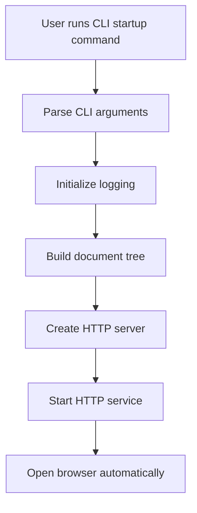
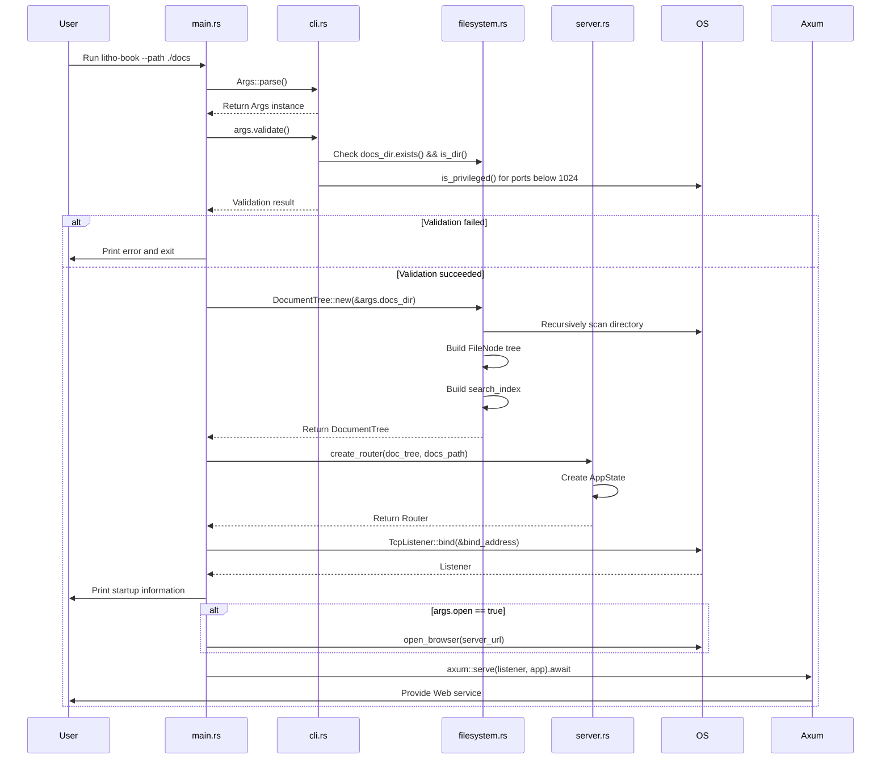
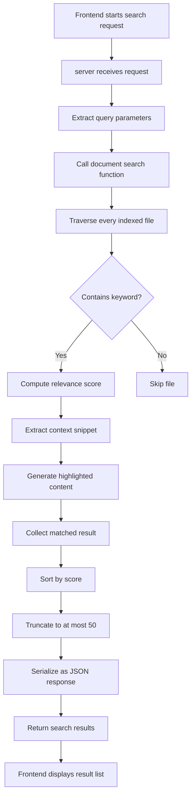
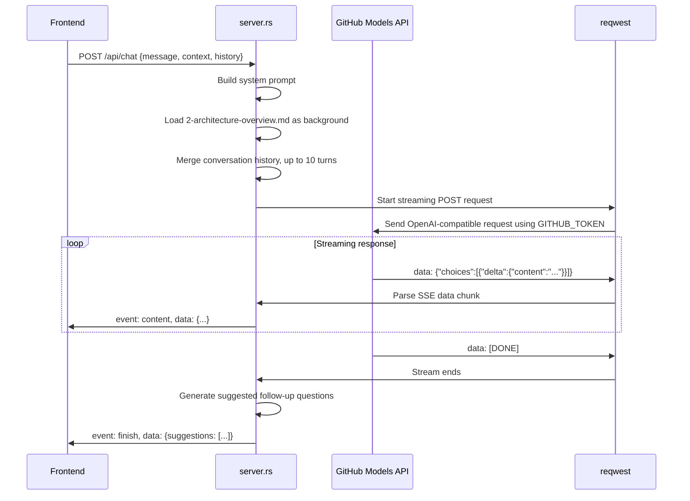
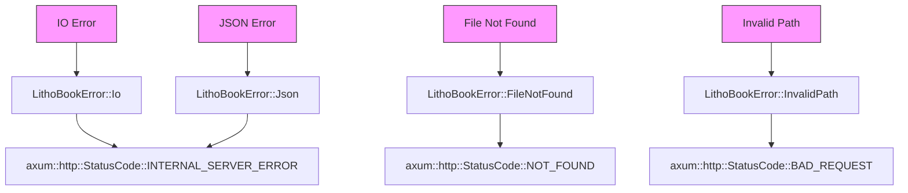
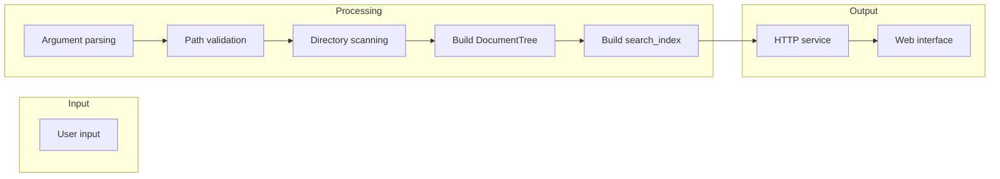

# Core Workflow

## 1. Workflow Overview

Litho Book is a Rust-based local document-management and AI-enhanced knowledge-exploration system. Its core workflows are built around four pillars: **document structuring, service startup, content retrieval, and intelligent interaction**. The system uses a CLI-driven plus Web-service architecture and relies on clear module boundaries to manage the full lifecycle from user input to service response.

### Main System Workflow
The main workflow begins when the user runs the CLI command. The system parses arguments, initializes the environment, builds the document tree, binds the HTTP service, and optionally opens the browser. This is the required path for first use and is the startup hub of the application.



### Core Execution Paths
- **Startup path**: `main.rs` → `cli.rs` → `filesystem.rs` → `server.rs`
- **Search path**: `Web request` → `server.rs` → `filesystem.rs::search_content()` → `Return results`
- **AI chat path**: `Web request` → `server.rs::chat_stream_handler()` → `GitHub Models API` → `SSE streaming response`

### Key Workflow Nodes
| Node | Responsible module | Input | Output | State |
|------|--------------------|-------|--------|-------|
| Argument parsing | cli.rs | CLI arguments | `Args` struct | Validating |
| Document scanning | filesystem.rs | Document directory path | In-memory `DocumentTree` | Building |
| Service binding | main.rs/server.rs | `AppState`, TCP address | `TcpListener` | Bound / failed |
| Search request handling | server.rs/filesystem.rs | Query keyword | `SearchResult` JSON | Processing / complete |
| AI streaming response | server.rs | User question, context | SSE event stream | Streaming |

### Flow Coordination
The system shares `DocumentTree` and configuration through the `AppState` structure inside the Axum Web service, enabling efficient access across requests. `main.rs` coordinates CLI parsing, filesystem scanning, and server startup so components initialize in the correct order.

---

## 2. Main Workflows

### Project Startup and Service Initialization

This is the system's most important initialization workflow and determines whether the application can start successfully.

#### Execution Order and Dependencies


#### Input and Output Flow
- **Input**:
  - `--path`: document directory path (`PathBuf`)
  - `--port`: service port (`u16`, default 3000)
  - `--host`: bind host (`String`, default 127.0.0.1)
  - `--open`: whether to open the browser automatically (`bool`)
  - `--verbose`: whether to enable verbose logs (`bool`)

- **Output**:
  - Startup banner and connection information printed to the console.
  - A complete `DocumentTree` built in memory.
  - An HTTP service listening on the selected port.
  - Optional browser launch to the service URL.

### Document Full-Text Search Workflow

This workflow lets users quickly locate relevant content in large Markdown collections and is a core scenario for knowledge workers.

#### Technical Flow


#### Relevance Scoring Algorithm
Search-result relevance is computed using weighted factors:
- **Basic match**: +1.0 point.
- **Heading match** (line starts with `#`): ×3.0.
- **Exact term match**: ×2.0.
- **Line-start match**: ×1.5.
- **Filename match**: +2.0 bonus.

### AI Assistant Streaming Chat Workflow

This workflow implements a natural-language interaction experience so users can ask for summaries and explanations based on document content.

#### Execution Flow


#### Data Transfer Details
- **Request construction**:
  ```rust
  let messages = vec![
      system_message("You are a professional documentation assistant..."),
      ...history,
      user_message(&request.message)
  ];
  ```
- **Streaming processing**: Uses `tokio::sync::mpsc::channel` to process byte streams in a background task and send parsed text chunks to the frontend.
- **Error recovery**: If the API call fails, a predefined friendly error message is returned so the user experience remains uninterrupted.

---

## 3. Flow Coordination

### Multi-Module Coordination

The system uses explicit module boundaries and interfaces for loose coupling:

| Coordination direction | Dependency type | Implementation |
|------------------------|-----------------|----------------|
| CLI → Filesystem | Data dependency | The `Args` struct passes the `docs_dir` path. |
| Filesystem → Server | Data sharing | `DocumentTree` is injected into route handlers through `AppState`. |
| Server → External API | Service call | `reqwest` sends asynchronous HTTP requests. |
| All → Error | Error mapping | `LithoBookError` is converted to `StatusCode`. |

### State Management and Synchronization

- **Shared `AppState` state**:
  ```rust
  #[derive(Clone)]
  pub struct AppState {
      pub doc_tree: DocumentTree,
      pub docs_path: String,
  }
  ```
  `Clone` lets multiple handlers safely share read-only state without global variables or lock contention.

- **Concurrency control**:
  - All read operations, including browsing and search, use lock-free concurrent access.
  - The document tree is built once at startup and is immutable at runtime.
  - AI streaming responses use independent `mpsc` channels for asynchronous communication.

### Data Transfer and Sharing

| Data item | Producer | Consumer | Transfer method |
|-----------|----------|----------|-----------------|
| DocumentTree | main.rs | server.rs | Function argument |
| Query Parameters | Axum Extractor | Handler Functions | Type-safe extraction |
| Search Results | filesystem.rs | server.rs | Direct in-memory object return |
| SSE Events | Background Task | Sse Stream | Asynchronous channel (`mpsc`) |

### Execution Control and Scheduling

- **Startup scheduling**: `main.rs` executes initialization steps strictly in order; any failure terminates the process.
- **Request scheduling**: Axum automatically handles concurrent requests, with each request executing in an independent task.
- **Timeout control**: No explicit timeout is set; behavior depends on the underlying TCP and HTTP client defaults.
- **Resource release**: Rust ownership guarantees that resources are cleaned up when they leave scope.

---

## 4. Exception Handling and Recovery

### Error Detection and Handling

The system uses layered error handling:



Key error-handling code:
```rust
impl From<LithoBookError> for axum::http::StatusCode {
    fn from(err: LithoBookError) -> Self {
        match err {
            LithoBookError::FileNotFound { .. } => StatusCode::NOT_FOUND,
            LithoBookError::InvalidPath { .. } => StatusCode::BAD_REQUEST,
            _ => StatusCode::INTERNAL_SERVER_ERROR,
        }
    }
}
```

### Exception Recovery Mechanisms

- **Startup phase**:
  - Argument validation failure: exit immediately and print the reason.
  - Directory scan failure: log the error and skip the problematic file while continuing to build.
  - Port binding failure: terminate and tell the user to change the port or check permissions.

- **Runtime phase**:
  - File read failure: return `404 Not Found`.
  - Search failure: return an empty result set rather than an error.
  - AI API failure: return a predefined degraded response.

### Fault-Tolerance Strategy

| Scenario | Fault-tolerance measure |
|----------|-------------------------|
| No Markdown files | Warn after scanning and still start the service. |
| Hidden files exist | Ignore `.git`, `.DS_Store`, and similar files automatically. |
| Insufficient permission for low-numbered ports | Prompt the user to use a port ≥1024. |
| Browser cannot be opened automatically | Display the manual access link. |
| AI stream interruption | Frontend displays the partial response content. |

### Retry and Degradation

- **No automatic retry currently implemented**: AI API calls are not retried after failure.
- **Degradation options**:
  - Search remains available even when the AI service is unreachable.
  - Basic document browsing does not depend on external services.
  - Error messages are user-friendly and avoid exposing technical details.

---

## 5. Key Process Implementation

### Core Algorithm Flow

#### Document Tree Construction Algorithm
```rust
fn build_tree(
    current_path: &Path,
    base_path: &Path,
    file_map: &mut HashMap<String, PathBuf>,
    search_index: &mut HashMap<String, Vec<String>>,
    stats: &mut TreeStats,
) -> anyhow::Result<FileNode>
```
**Execution steps**:
1. Obtain the file or directory name and relative path.
2. If the entry is a file with `.md` extension:
   - Record metadata such as size and modification time.
   - Add it to the `file_map` index.
   - Read the full text and store it line by line in `search_index`.
   - Update statistics.
3. If the entry is a directory:
   - Recursively scan child entries.
   - Sort children by “directories first, then alphabetical order”.
   - Build the `children` list.
4. Return the `FileNode` instance.

#### Full-Text Search Algorithm
```rust
pub fn search_content(&self, query: &str) -> Vec<SearchResult>
```
**Execution pipeline**:
1. Convert the query to lowercase.
2. Traverse every file and every line in `search_index`.
3. For each line:
   - Perform lowercase keyword matching.
   - Compute relevance score using heading, exact-match, and position weights.
   - Extract surrounding context.
   - Generate a highlighted HTML fragment.
4. Collect all matched results.
5. Sort by score descending.
6. Truncate to at most 50 entries.
7. Return the result list.

### Data Processing Pipeline



### Business Rule Execution

| Rule | Implementation location | Logic |
|------|--------------------------|-------|
| Index only `.md` files | filesystem.rs | `path.extension() == Some("md")` |
| Ignore hidden files | filesystem.rs | Skip dot files while traversing dot directories like normal directories. |
| Directories first | filesystem.rs | Directories are ordered before files in `sort_by`. |
| Heading-weighted search | filesystem.rs | `line.trim().starts_with('#')` ×3.0 |
| Return at most 50 results | filesystem.rs | `results.truncate(50)` |
| Limit conversation history | server.rs | `max_history = 10` |

### Technical Implementation Details

#### Performance Optimization
- **Memory cache**: The document tree and search index are built in memory to avoid repeated I/O.
- **Lazy loading**: Concrete file content is read only when requested.
- **Streaming**: AI responses are returned in SSE chunks to reduce perceived latency.
- **Concurrency**: Tokio supports high-concurrency asynchronous requests.

#### Security Considerations
- **Path traversal protection**: Uses `strip_prefix(base_path)` to keep file access inside the allowed directory.
- **Input validation**: CLI arguments are comprehensively validated at startup.
- **Error sanitization**: Internal errors are not directly exposed to the frontend.
- **Credential handling**: GitHub Models uses `GITHUB_TOKEN`; tokens are not hardcoded.

#### Maintainability Design
- **Modular architecture**: Each `.rs` file has a focused responsibility and is easy to understand and test.
- **Trace logging**: `tracing` macros record key execution points.
- **Centralized configuration**: CLI parameters are defined in the `Args` structure.
- **External dependency isolation**: AI API calls are encapsulated in dedicated functions for easier replacement.

Through rigorous workflow design and high-quality implementation, the system provides a stable, efficient, and intelligent local knowledge-management solution.
