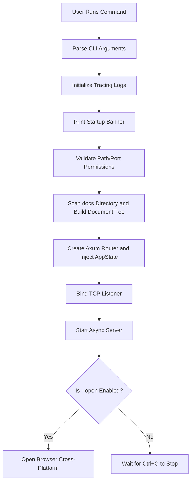

# **Litho-Book System Support Domain Technical Implementation**

---

## **1. Module Overview**

The **system support domain** is the core module in Litho-Book responsible for common infrastructure capabilities. It does not directly participate in business-logic processing; instead, it provides low-level guarantees for stable operation, consistent errors, and lifecycle management across the system. The module follows a high-cohesion, low-coupling design principle so core business logic, such as document browsing and AI chat, can focus on feature implementation without having to manage cross-cutting concerns such as logging, error mapping, or service startup.

Based on the research material, the system support domain contains two key submodules:
- **Error Handling Hub**
- **Application Startup Coordinator**

Together, these components form the application's skeleton. They bridge the user interaction domain and document data domain and are an important foundation for system robustness.

---

## **2. Detailed Submodule Implementation**

### **2.1 Error Handling Hub (`error.rs`)**

#### **2.1.1 Design Goals**
- Centrally manage all custom error types.
- Automatically convert internal errors into HTTP status codes.
- Provide clear error semantics and contextual information.
- Support cross-module error propagation and centralized handling.

#### **2.1.2 Core Implementation Mechanism**

The `thiserror` crate defines the enum error type `LithoBookError`. Through the `From` trait, errors are automatically mapped to `axum::http::StatusCode`, enabling unified responses at the Web layer.

```rust
// src/error.rs
use thiserror::Error;

#[derive(Error, Debug)]
pub enum LithoBookError {
    #[error("IO error: {0}")]
    Io(#[from] std::io::Error),

    #[error("JSON serialization error: {0}")]
    Json(#[from] serde_json::Error),

    #[error("File not found: {path}")]
    FileNotFound { path: String },

    #[error("Invalid file path: {path}")]
    InvalidPath { path: String },

    #[error("Directory scan error: {0}")]
    DirectoryScan(String),

    #[error("Server error: {0}")]
    Server(String),

    #[error("Configuration error: {0}")]
    Config(String),
}
```

> ✅ **Advantages**:  
> - The `#[from]` attribute allows automatic conversion from `std::io::Error` and `serde_json::Error`, reducing boilerplate.
> - Each variant implements the `Display` trait, which helps with logging and debugging.

#### **2.1.3 HTTP Status-Code Mapping**

By implementing `From<LithoBookError> for axum::http::StatusCode`, application-level errors are automatically converted into standard HTTP response codes:

```rust
impl From<LithoBookError> for axum::http::StatusCode {
    fn from(err: LithoBookError) -> Self {
        match err {
            LithoBookError::FileNotFound { .. } => StatusCode::NOT_FOUND,
            LithoBookError::InvalidPath { .. } => StatusCode::BAD_REQUEST,
            LithoBookError::Json(_) => StatusCode::INTERNAL_SERVER_ERROR,
            LithoBookError::Io(_) => StatusCode::INTERNAL_SERVER_ERROR,
            LithoBookError::DirectoryScan(_) => StatusCode::INTERNAL_SERVER_ERROR,
            LithoBookError::Server(_) => StatusCode::INTERNAL_SERVER_ERROR,
            LithoBookError::Config(_) => StatusCode::BAD_REQUEST,
        }
    }
}
```

> 🔄 **Example call chain**:
> ```text
> filesystem::get_file_content() → Err(FileNotFound) 
> → Axum automatically calls .into() → StatusCode::NOT_FOUND 
> → Return a 404 response to the frontend
> ```

#### **2.1.4 Usage in Route Handlers**

Axum allows any type `T: Into<axum::response::Response>` to be used as a return value. Combined with `anyhow::Result<T, E>` and `.map_err(Into::into)`, this integrates seamlessly:

```rust
async fn get_file_handler(
    Query(params): Query<FileQuery>,
    State(state): State<AppState>,
) -> Result<Json<FileResponse>, StatusCode> {
    let content = state.doc_tree.get_file_content(&file_path)
        .map_err(|e| {
            error!("Failed to read file {}: {}", file_path, e);
            StatusCode::NOT_FOUND
        })?;
    // ...
}
```

A more elegant approach is to use the `?` operator with a global error type:

```rust
type ApiResult<T> = Result<T, LithoBookError>;

async fn search_handler(...) -> ApiResult<Json<SearchResponse>> {
    let results = doc_tree.search_content(query)?;
    Ok(Json(SearchResponse { ... }))
}
```

Axum then automatically calls `From<LithoBookError>` to complete status-code conversion.

---

### **2.2 Application Startup Coordinator (`main.rs`)**

#### **2.2.1 Module Responsibilities**
As the application's main entry point, `main()` has the following key responsibilities:
1. Parse command-line arguments.
2. Initialize the logging system.
3. Print the startup banner.
4. Validate configuration.
5. Build the document tree structure.
6. Create and bind the Web service.
7. Open the browser automatically when requested.

It is essentially a **process orchestration center** that coordinates modules during system initialization.

#### **2.2.2 Startup Flow Diagram**



#### **2.2.3 Key Technical Details**

##### (1) Asynchronous Main Function Declaration
```rust
#[tokio::main]
async fn main() -> anyhow::Result<()> { ... }
```
- Uses the `tokio::main` macro to start the async runtime.
- Returns `anyhow::Result` to support propagation of arbitrary error types.

##### (2) Logging Initialization (`init_logging`)
Structured logging is implemented with `tracing` and `tracing-subscriber`:

```rust
fn init_logging(verbose: bool) {
    let filter = if verbose {
        tracing_subscriber::filter::LevelFilter::DEBUG
    } else {
        tracing_subscriber::filter::LevelFilter::INFO
    };

    tracing_subscriber::registry()
        .with(tracing_subscriber::fmt::layer().without_time().with_target(false))
        .with(filter)
        .init();
}
```

> ⚠️ File names and line numbers are not currently logged, which is suitable for production. For debugging, enable `.with_file(true).with_line_number(true)`.

##### (3) Cross-Platform Browser Auto-Open (`open_browser`)

Conditional compilation provides compatibility across platforms:

```rust
#[cfg(target_os = "windows")]
fn open_browser(url: &str) -> anyhow::Result<()> {
    std::process::Command::new("cmd").args(["/c", "start", "", url]).spawn()?;
}

#[cfg(target_os = "macos")]
fn open_browser(url: &str) -> anyhow::Result<()> {
    std::process::Command::new("open").arg(url).spawn()?;
}

#[cfg(target_os = "linux")]
fn open_browser(url: &str) -> anyhow::Result<()> {
    let browsers = ["xdg-open", "firefox", "chromium", "google-chrome"];
    for browser in &browsers {
        if std::process::Command::new(browser).arg(url).spawn().is_ok() {
            return Ok(());
        }
    }
    anyhow::bail!("No suitable browser found");
}
```

> ✅ **Robustness design**: failures do not interrupt the service; they only produce warning logs.

##### (4) TCP Service Binding and Listening**

A `tokio::net::TcpListener` asynchronously binds the address:

```rust
let listener = TcpListener::bind(&bind_address).await?;
info!("Server bound successfully: {}", bind_address);

axum::serve(listener, app).await?;
```

- If the port is occupied or lacks permission, the application exits early and informs the user.
- `axum::serve()` starts the non-blocking service.

##### (5) AppState Injection Mechanism**

`DocumentTree` and `docs_path` are wrapped into shared state for all routes:

```rust
let state = AppState {
    doc_tree,
    docs_path,
};

let app = Router::new()
    .route("/", get(index_handler))
    .with_state(state); // ← Global state injection
```

> 🔐 **Security note**: `AppState` must implement `Clone` or `Sync + Send`; this code uses `#[derive(Clone)]`.

---

## **3. Inter-Module Collaboration Analysis**

| Caller | Callee | Collaboration | Description |
|--------|----------|---------|------|
| `main.rs` | `cli.rs` | Service call | The main program calls `Args::parse()` to obtain configuration |
| `main.rs` | `filesystem.rs` | Data dependency | Builds `DocumentTree` and injects it as state |
| `main.rs` | `server.rs` | Service call | Creates the router and passes state |
| `server.rs` | `error.rs` | Error mapping | All errors are ultimately converted into HTTP status codes |
| `filesystem.rs` | `error.rs` | Error wrapping | IO/JSON errors are wrapped as `LithoBookError` |

> 🧩 **Architectural value**: the system support domain sits upstream in the call chain. It both initiates the flow and receives exceptions, acting as the system glue.

---

## **4. Reliability and Extensibility Evaluation**

### **4.1 Existing Strengths**
- ✅ **Unified error handling**: consistent error feedback for frontend and backend.
- ✅ **Clear startup flow**: linear control flow is easy to understand and maintain.
- ✅ **Cross-platform compatibility**: automatic browser opening on Windows, macOS, and Linux.
- ✅ **Asynchronous high performance**: non-blocking I/O model based on Tokio.
- ✅ **Log-level control**: `--verbose` enables detailed logs.

### **4.2 Potential Improvements**

| Issue | Suggested Solution |
|------|---------|
| Hardcoded API key | Load it from the `GITHUB_TOKEN` environment variable |
| Inline HTML template | Move it to an external `templates/index.html.tpl` file to avoid recompilation |
| Missing configuration file | Add `litho-book.toml` support for persistent configuration |
| Full-tree rebuild on file changes | Consider incremental updates for very large documentation sets |
| High memory usage | Add an LRU cache for rendered results, for example with the `lru` crate |

---

## **5. Summary**

Although the **system support domain** does not directly serve user-facing requirements, it is the core guarantee of Litho-Book availability. Through its two pillars, the **unified error-handling mechanism** and **application startup orchestration**, it provides these benefits:

- **Improved stability**: standardized error mapping prevents uncaught exceptions from crashing the service.
- **Higher developer productivity**: developers do not need to manually handle the HTTP status code for every error type.
- **Better user experience**: automatic browser opening, colored log messages, and startup statistics.
- **Clearer architecture**: concern boundaries are explicit, making the main flow highly readable and easy to test.

The module's design reflects the strengths of the Rust ecosystem in type safety, zero-cost abstractions, and engineering practice. It is an essential infrastructure component for modern full-stack applications.

--- 

> 📌 **Appendix: Core Dependency List (Cargo.toml excerpt)**
> ```toml
> [dependencies]
> thiserror = "1.0"
> anyhow = "1.0"
> tracing = "0.1"
> tracing-subscriber = "0.3"
> tokio = { version = "1.47", features = ["full"] }
> ```
